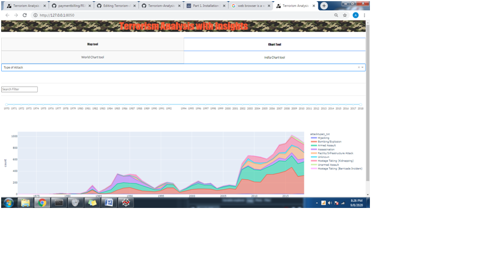

# Terrorism-Analysis-with-Insights
<h1>Objective</h1>
<h5>A website which is use to give information about Terrorism-Analysis-with-Insight that stored in a database.
It give map according to region, country, state, city at which year, month, day.
</h5>
<h1>Tools Used</h1>

1. Anaconda(Spyder) 
2. Python 3.8 
3. Dash 1.15.0 
4. Web browser 

<h1>Visualization of data is done and represented in below two ways:</h1>
<h2>1. Map Tool Tab</h2>
<br\>
<h3>
	a. World Map Tool<br\>
	</h3><h3>
	b. India Map Tool
</h3>
	<h2>2. Chart Tool Tab</h2>
<br\>
<h3>
	a. World Chart Tool<br\>
	</h3><h3>
	b. India Chart Tool
</h3>
	
<h3>Map Tool Tab: </h3>

		In this tab we can see a whole countries map and it show points on that latitude and longitute there attack is happpen in between 1970 to 2018 or according to database.
 There are several dropdown and a range slider in MAP UI 
like: 
Month, 
Date, 
Region, 
Country, 
Province/State, 
City, 
Attack-Type, 
Year 

<h3>
a. World Map Tool Subtab:</h3>

There are no filled dropdown there user can choose it as per requirement and also select the range of year. It give Output in form of points on map.

<h3>
b. India Map Tool Subtab:</h3> 

	The Region and country are fixed and set to South Asia and India respectively. Rest everything works similarly to the World Map tool.

<h3>Chart Tool Tab:</h3>

In which Tab two subtabs are shown a. World Chart and b. India Chart
 

In chart tool tab a area chart is shown in that page(Tab).
	the label of Chart is change according to which option is selected in dropdown.
Tab there are one Dropdown and one Input Search box and Selecting range of years using range Slider
In DropDown : Region is selected by default. if you can change it with other Fields 
e.g. Terrorist Organisation,Target Type,Weapon Type,Type of attack,Target Nationality
with a filter you can filter data in that type of selection 

<h3>
a. World Chart Tool Subtab:</h3>
 
According to filters and selection of dropdown a Area Chart is shown in World Chart tool tab.
The dropdown filter, which groups incidents based on dropdown value, is also the legend of the Area Chart.
The search filter works as search for a specfic requirement among all, like a country details or attack type or any.

<h3>b. India Chart Tool Subtab :</h3>

The Region and country are fixed and set to South Asia and India respectively. Rest everything works similarly to the World Chart tool.

<h1>
Working of Project with Screenshots
	<h1>
		<h4>This is Loading page for updating a graph.
		</h4>
		
		<h4>
		This is Home Page of Website.
		</h4>
		
		<h4>
			It Show by default Map .i.e. it takes data of all regions or countries.</h3>
		<h4>
			It show some filteration of data and it take multiple values in particular dropdowns.</h4>
		
		<h4>It show there is no attackes on that day,month,region,country,state,city,attacktype and year which is selected in previous image.</h4>
		
		<h4> It show India tab is selected and by default the region is South Asia and country is India is Selected and this two dropdown is diabled in this tab and remaing dropdown work as previously.</h4>
		
		<h4> It give the output in map.There was filter applied on previous image.</h4>
		
		<h4>It shows the Chart tab and World chart tab is selected and dropdown(by default Region) and a Search filter are there.</h4>
		
		<h4>Output of region.</h4>
		
		<h4>In dropdown option Weapon Type is selected.</h4>
		
		<h4>Output of Weapon Type.</h4>
		
		<h4>It show the chart tool and India chart tool tab is selected. In Region South Asia is selected by default.</h4>
		
		<h4>Output of Region=="South Asia".</h4>
		
		<h4>It shows the type of attack happen in India and its output.</h4>
		
		
